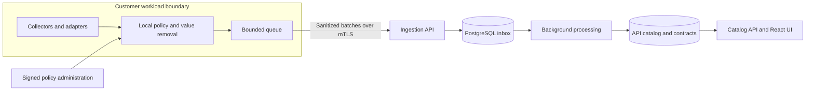

# APIContour

APIContour is an enterprise API discovery and contract intelligence project.
Its goal is to show which APIs an organization uses, what data structures those
APIs exchange, and how those structures change across services and deployments.

It is designed to observe authorized traffic, remove values locally, and send
only approved structural information to a central catalog. Teams will compare
observed structures with declared and approved contracts, then review changes.

**Status: under development.** This repository currently contains the Rust core
and three PostgreSQL migrations for identity, policy, and inbox storage. The Rust
database adapter validates authority, stores batches, and returns durable receipts.
The core also provides checked record construction and bounded in-memory retention.
An operator-configured mTLS HTTPS ingestion library includes a synthetic
HTTPS-to-restricted-PostgreSQL fixture. A deployable platform, released collector
and web UI remain pending. The architecture and packages below describe the
intended release.

## Enterprise workflows

| Team | Intended workflow |
|---|---|
| Platform | Enroll collectors, set capture scope, publish policy, and revoke access |
| Service owners | Review API variants and approve a specific contract version |
| Developers | Compare declared contracts with observations and check changes in CI |
| Security | Find APIs without an approved catalog entry and inspect visibility gaps |
| Operations | Monitor collection health, data loss, backlog, retention, and recovery |

Observed, declared, and approved contracts remain separate. An observation does
not approve a contract. An API that was not observed is not proof that it is absent.
Counts remain specific to each capture source unless a tested method removes duplicates.

## Intended architecture



Rust supplies the backend and shared structural core. PostgreSQL is the central
system of record. React and TypeScript will supply the web UI.

Collectors will send bounded batches to the ingestion API; they will not connect
to PostgreSQL directly. Embedded collectors will use bounded memory by default.
Standalone collectors may use an optional local SQLite queue for sanitized data.
Bounded retention, authenticated single-attempt delivery, and caller-driven retry
decisions are implemented in shared libraries. Enrollment, a full background
scheduler, splitting, durable local storage, and capture callback integration
remain pending.

Collection must not wait for a remote response on the application request path.
If a collector reaches its limits, it must report loss or incomplete visibility.
Encrypted traffic exposes only what the authorized capture point can see.
APIContour will not bypass certificate pinning or collect TLS secrets.
Collection is passive. It must not probe endpoints, replay production requests,
change request routing, or join business consumer groups to obtain messages.

## Planned packages and coverage

| Package | Intended use |
|---|---|
| Platform images, Helm chart, and migrations | Enterprise deployment with PostgreSQL |
| Docker Compose bundle | Local evaluation with synthetic traffic |
| Gateway and runtime adapters | Observe traffic at approved proxies or application hooks |
| Linux host agent | Authorized host observation, including a separate eBPF component |
| Managed browser, Android library, and iOS framework | Observe supported client interactions |
| AWS, GCP, Azure, and messaging connectors | Read approved telemetry or supported traffic sources |
| CLI and CI integration | Import, export, and compare contracts |
| Offline bundle | Install versioned packages without external runtime services |

Runtime/serverless, Kubernetes, Docker, and CI integrations are part of the
required scope. Protocol work includes HTTP, JSON, XML, forms, GraphQL, gRPC,
WebSocket, Kafka, and MQTT within tested support profiles. This list describes
planned coverage; it is not a claim that these integrations are available today.

Customer-hosted deployment is the proposed production model. The hosting decision
and production target are still pending. No production deployment is included yet.

## Implemented today

- Operator-configured mTLS HTTP/1 ingestion with certificate fingerprint scope
  binding, bounded requests, and accepted/duplicate durable receipt responses.
  Enrollment and deployment integration remain pending.

- Checked structural types, canonical encoding, and SHA-256 fingerprints.
- Bounded local JSON extraction that returns structure without observed values.
- Strict sanitized batch decoding, time checks, and canonical request digests.
- Checked record construction and a bounded memory queue with expiry, policy
  reconciliation, capacity loss counters, and permanent local revocation.
- Signed Ed25519 policy verification, identity checks, and bounded policy leases.
- Pure batch admission against historical and current policies and supplied source assignments.
- PostgreSQL identity tables, tenant row security, and restricted runtime roles.
- Immutable policy history, active collector revision/revocation state, enrolled
  source profiles, separated administration/ingestion privileges, and advisory locks.
- Checked PostgreSQL deployment settings and owned TLS transport with explicit
  bounded CA trust, verified server identity, and cooperative DNS/TLS/auth deadlines.
  No arbitrary-query or raw-client public API is exposed.
- Transactional authority validation under restricted ingestion privileges, with
  current/historical signature checks and locked database scope. Its success does
  not authorize a later write; submission checks authority again while holding the
  collector lock.
- Immutable inbox headers and bounded batch storage with tenant isolation and
  ingestion-only access. Atomic submission returns server-generated receipts; exact
  retries verify stored content and return the original receipt.
- Real PostgreSQL process-crash recovery and lost COMMIT reply tests. A confirmed
  commit retains its receipt even if connection cleanup then fails.
- Authenticated single-attempt collector delivery and metadata-only retry decisions,
  with bounded jitter/Retry-After, hard renewal pauses, and TTL-only cleanup. See
  [delivery behavior and remaining integration](crates/contour-delivery/README.md).
- Rust CI on Linux and macOS, plus actual PostgreSQL integration tests.

Pure admission validates a supplied snapshot. HTTP authentication and checked
receipts are implemented with explicit operator configuration. Capture-side
revocation integration, authenticated enrollment/renewal, persistent revision
high-water storage, durable queues, the full delivery scheduler, splitting, released
collectors, contract comparison, and the UI remain pending.
Full platform, device, cloud, backup/restore, and performance acceptance is pending.

## Build and test the current code

Install Rust 1.88 or later. Fetch the locked dependencies once, then run the checks:

```sh
cargo fetch --locked
cargo fmt --all -- --check
cargo clippy --workspace --all-targets --locked --offline -- -D warnings
cargo test --workspace --locked --offline
cargo build --workspace --locked --offline
```

For database tests, install Docker and fetch the pinned PostgreSQL fixture:

```sh
docker pull postgres@sha256:0ea6700a3b4f0ae6ce746519073558aed4d88a79d8d07622a9a644946c7319c4
bash scripts/test-postgres.sh
python3 -u scripts/test-postgres-tls.py --authority
python3 -u scripts/test-postgres-tls.py --https-only
python3 -u scripts/test-postgres-tls.py --delivery-only
```

The SQL test uses a temporary container without network access. The TLS test uses
a verified loopback-only port and synthetic certificates. Its authority and
recovery cases use a fresh, owned Docker volume to test PostgreSQL restart. Tests
remove their owned containers, volumes, and networks; no host data directory is
mounted. See [database setup and security boundaries](db/README.md). These commands
start isolated synthetic test services; they do not launch a deployable APIContour
platform. HTTPS and delivery cases exercise the actual restricted database.

## Design documents

- [Complete specification and validation commands](docs/specification/README.md)
- [Implemented memory queue and its limits](docs/memory-queue.md)
- [Product scope and required workflows](docs/specification/01-product.md)
- [Privacy, signed policy, and admission rules](docs/specification/03-privacy.md)
- [Structural data and PostgreSQL model](docs/specification/04-data.md)
- [Collection, queues, batches, and delivery](docs/specification/05-delivery.md)
- [Performance targets and operations](docs/specification/08-operations.md)

The design documents include requirements that are not implemented yet.
Performance targets are acceptance criteria, not measured results.
