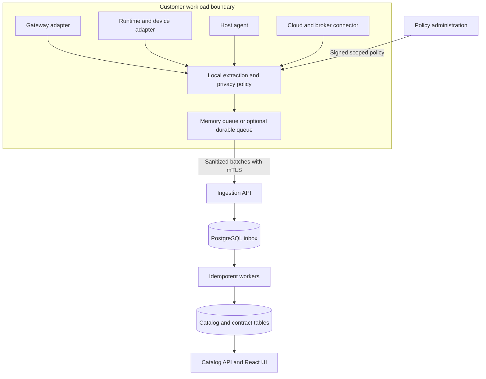

# Architecture and packaging

## Components

Use one shared Rust structural model. Keep interfaces versioned. Build ingestion, catalog and background processing as distinct process roles from a shared workspace. Do not require a separate distributed service for each internal module.

For cloud logs, a connector can receive raw provider records inside the authorized customer boundary. It must filter them before local persistence or forwarding. Platform ingress rejects arbitrary raw telemetry formats.

## Package outputs

| Package | Required artifact |
|---|---|
| Platform | OCI images for API and worker roles, UI assets, Helm chart, migrations |
| Evaluation | Docker Compose configuration and synthetic example data |
| Linux host | Signed service package and container; separate privileged eBPF component |
| Gateway | Version-specific integration packages with attach and detach procedures |
| Runtime | Published libraries with shared Rust core through supported bindings |
| Browser | Managed extension package and policy templates |
| Mobile | Android library and iOS framework with build and signing instructions |
| Cloud and broker | Separate connector images and least-privilege permission templates |
| Automation | CLI for contract import, export and CI comparison |
| Offline installation | Images, checksums, signatures, dependency inventory and offline instructions |

Runtime processes must use minimum privileges. Only the selected host capture component may request documented elevated privileges. A collector must not have direct database access.

Standalone agents can use an optional durable queue. SQLite is a candidate that requires dependency review and crash testing. Embedded libraries use bounded memory by default. Browser and mobile persistence use platform storage only when policy enables it. No queue contains raw values.

## Deployment

The baseline proposes customer-hosted production deployment. The owner decision is recorded in [Decisions](10-decisions.md). Logical tenant and project isolation is required regardless of hosting. Production uses an external supported PostgreSQL service with backups. Evaluation can use a local container database.

Collectors must keep working within their limits when the platform is unavailable. They must not hold application requests for remote acknowledgments. Multi-region deployments must use explicit data-location scopes. Cross-region movement requires customer policy; it must not happen as an automatic fallback.

Release manifests bind server, schema, policy and collector versions. The first release has one supported wire major version. A mismatched major version is rejected with a stable error. An upgrade must test overlap between the previous and next supported collector builds before publication.
