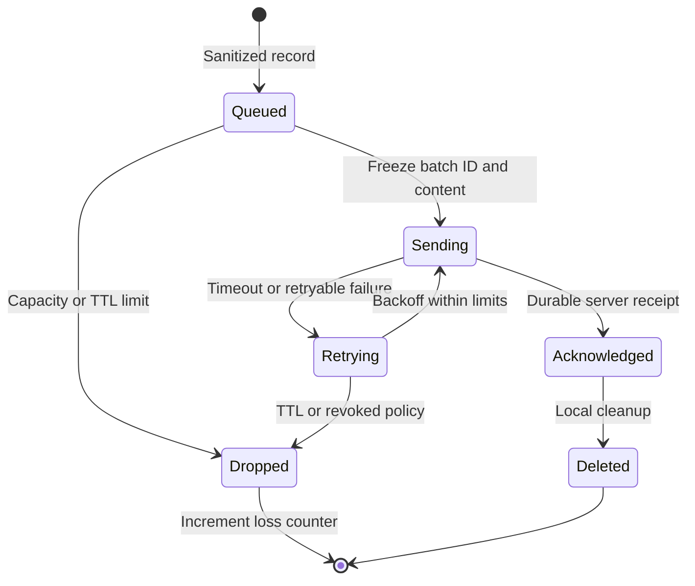

# Collection and delivery

## Local processing

Capture callbacks must not wait for network, database or disk operations. They can perform bounded extraction or copy a bounded transient buffer for local extraction. Raw buffers must never enter persistent queues. If capacity is unavailable, release the buffer and report loss.

A standalone collector can persist sanitized batches. The initial design uses a single background writer and an optional SQLite queue on local storage. Do not use a network-mounted shared database. Exact storage library approval is a preflight dependency. [SQLite deployment guidance](https://www.sqlite.org/whentouse.html) describes its embedded use and single-writer constraints.

Memory mode loses pending records on process exit. Durable mode retains only committed batches. Both modes must report their durability setting. Durable storage must use customer-approved at-rest protection. Do not assume standard SQLite encrypts files.

## Batch lifecycle

Each record has immutable queued_at and expires_at timestamps assigned when it first enters the sanitized queue. expires_at must be no later than queued_at plus the configured TTL. Splitting or repacking preserves these timestamps. A revoked identity cannot transfer queued records to a new identity; purge them and report loss.

A batch ID is a random UUID created once. Retries preserve ID and exact content. The batch identity is scoped by tenant and collector. Same ID with different canonical content returns conflict. The server uses a server-computed canonical request digest, excluding no submitted semantic field. JSON key order is not a content change.

Delivery is at least once within configured limits. There is no lossless guarantee. Server deduplication prevents retry-induced double counting. The collector cannot delete a batch based only on a TCP success or an uncommitted HTTP response.

The server returns 200 only after durable inbox commit. Response fields are batch_id, status (accepted or duplicate), receipt_id and accepted_at. A worker can process later. An acknowledged inbox must be recoverable under the selected database recovery profile.

## Failure handling

| Result | Collector action |
|---|---|
| 200 | Verify matching batch ID and receipt; remove acknowledged batch |
| 400 or 422 | Do not retry unchanged data; discard with safe reason counter |
| 401 or 403 | Stop sends; renew only through authorized enrollment; retain within TTL |
| 409 | Stop this batch and report ID/content conflict without content logging |
| 413 | Split by records into new batches; discard one oversize record with counter |
| 429 or 503 | Honor bounded Retry-After; retry with jitter |
| Timeout or other 5xx | Retry same batch; acknowledgment might have been lost |
| Unsupported wire major | Stop sends for that profile and report incompatibility |

Start retry delay at 1 second, cap at 60 seconds, and apply full jitter. Permit a maximum 5-minute Retry-After delay; TTL still applies. These are design defaults, configurable below resource limits.

Default durable TTL is 24 hours. Server acceptance allows batches created within 24 hours plus 5 minutes clock skew; older or future batches fail validation. It also rejects expired records and deadlines beyond the maximum permitted TTL. A new batch creation time never renews a record deadline. Retain deduplication keys for at least 7 days. Time validation uses batch creation time; source event times are separately marked if unreliable. Clock drift must not create fabricated event chronology.

## Aggregation and limits

Flush at 5 seconds, 500 records or 1 MiB serialized uncompressed data, whichever comes first. A new structural variant can trigger an earlier flush. Keep full structure in each transmitted record in v1; do not require server cache state to decode a fingerprint-only record.

Aggregate equal structures only within the same operation, policy, deployment, source, visibility and time window. Freeze counters when a batch is created. Later observations belong to a new batch. A lost batch must not remove the structure from all future batches.

When full, drop new observation records instead of blocking the application. Expire old queued records at TTL. Reserve a separate bounded health accumulator for dropped, expired, malformed and sampled counts. Send health through a separate authenticated endpoint with independent quota. Health reporting may itself be unavailable; the UI must then show stale health rather than zero loss.

Cloud collection checkpoints advance only after sanitized data is durably queued, or after durable server receipt in memory mode. Source rereads can cause duplicates distinct from delivery retries; use safe source event identity where available and document cases where unique counts cannot be established. Never commit a business consumer offset or acknowledge a business message for discovery.
