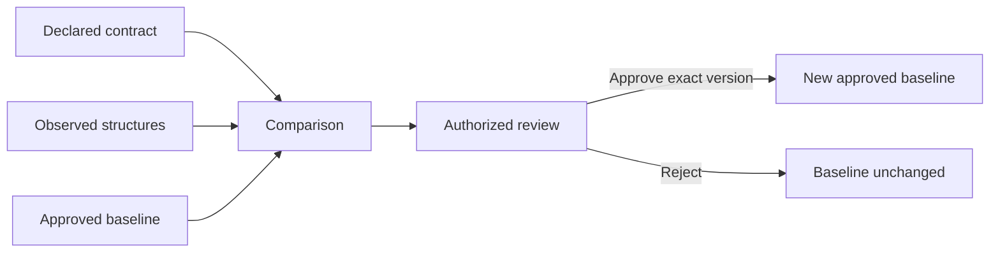

# Platform APIs and review workflows

## API conventions

Base path is /v1. All calls require an authenticated principal except readiness and liveness probes, which expose no business data. Enrollment authenticates the single-use bootstrap credential over server-authenticated TLS; it cannot require a collector certificate before enrollment. All later collector calls require the issued mTLS identity. Collector credentials access collector endpoints only. Tenant scope comes from verified identity. Project and service authorization applies in addition to tenant isolation.

Use JSON with explicit content type. Reject unknown fields in write bodies. Return errors as code, safe message, request_id and retryable. Do not echo input. Use 400 for malformed syntax, 401 for missing/invalid identity, 403 for denied scope, 404 for unknown or concealed resources, 409 for version conflict, 413 for size limits, 422 for semantic validation, 429 for quota and 503 for temporary unavailability.

List endpoints use limit (default 50, maximum 200) and an opaque cursor. Sort by a stable identifier plus tie-breaker. Bind cursors to scope and filter. Do not accept arbitrary SQL or arbitrary regular expressions as filters.

## Collector interface

| Endpoint | Input and result |
|---|---|
| POST /v1/enrollments | Single-use bootstrap credential and public identity material; return scoped enrollment result |
| GET /v1/collector-policy | Return signed policy matching the authenticated collector and revision |
| POST /v1/collector-authority | Return a challenge-bound current policy and source snapshot for an enrolled collector |
| POST /v1/batches | [Batch schema](contracts/batch.schema.json); durable receipt from [Delivery](05-delivery.md) |
| POST /v1/collector-health | Versioned bounded counters, queue bytes, mode and last-policy revision; no free text or raw labels |

The [OpenAPI contract](contracts/platform.openapi.json) defines request and response shapes, including enrollment, signed policy and health. The batch schema is normative for the ingestion body. Policy admission precedes every inbox write, as specified in [Privacy](03-privacy.md). P01 must validate these artifacts with standard validators and implement their semantic checks. No free-form diagnostic payload is permitted.

The additive authority endpoint preserves the existing policy response contract.
Its complete request is at most 32 KiB: wire version 1, a fresh 32-byte random
challenge encoded as 64 lowercase hexadecimal characters, and 1–500 unique
canonical source UUIDs. Reject duplicate or unknown fields. Identity comes only
from the verified collector certificate. The response echoes the challenge and
includes the scoped identity, database check time, unchanged signed policy fields,
and authoritative workload, technique and parser assignments for exactly those
sources. It is at most 8 MiB and uses `Cache-Control: no-store`. Refresh and batch
ingestion share the same database session budget and original request deadline.
This endpoint does not issue identities or register sources. A response is a
snapshot; it is not itself permission to resume capture from cached state.

POST /v1/collector-sources registers a source under an enrolled collector. The platform checks its project/service/environment/deployment assignments. The instance_nonce makes registration idempotent within the collector scope. It returns a server-assigned source_id. Collector health counters are cumulative within counter_epoch; a restart creates a new epoch. Duplicate report_id values do not add counts.

GET /v1/reviews/{id} returns the exact review and baseline association. GET /v1/reviews and GET /v1/collector-health support the review queue and health views. POST /v1/policies requires policy-administrator permission, validates a monotonic revision, signs the exact payload bytes, and audits publication. POST /v1/collectors/{id}/revocation invalidates an identity with expected-revision concurrency control. Revocation is irreversible for that identity; reenrollment creates a new identity.

## Catalog interface

| Endpoint | Required behavior |
|---|---|
| GET /v1/operations | Filter by project, service, environment, protocol, source and visibility |
| GET /v1/operations/{id} | Return identity, variants, source coverage and current approved version |
| GET /v1/operations/{id}/variants | Return immutable structures and per-source evidence summaries |
| POST /v1/contracts/import | Bounded supplied artifact; parse locally in platform process, sanitize before persistence; never fetch remote references |
| GET /v1/contracts/{id}/export | Export sanitized approved or explicitly selected declared structure in supported format |
| POST /v1/comparisons | Compare exact left/right version IDs; return typed differences with evidence limits |
| GET /v1/comparisons/{id} | Retrieve the immutable comparison and exact version references after reload |
| POST /v1/reviews | Create pending review tied to operation, comparison and immutable versions |
| POST /v1/reviews/{id}/decision | approve or reject with expected_revision; record actor and decision atomically |
| GET /v1/audit-events | Scoped, paginated history; no mutation endpoint |
| POST /v1/ci-checks | Supplied sanitized contract and approved baseline ID; return pass, fail or inconclusive |

Import maximum is 5 MiB after decompression. Disable remote references and recursive expansion beyond parser limits. Store the sanitized normalized model, not the uploaded raw artifact. Imports must distinguish unsupported constructs from compatible contracts.

Decision requests include expected_revision. A transaction locks/checks the review and current approved association, then creates the approval and audit entry. Concurrent approvals cannot both replace the same expected baseline. Return 409 to the loser. Self-approval restrictions are customer policy; record the approving principal in all cases.

A discrepancy is evidence of a difference, not automatically a breaking change. Compare request and response direction separately. Observed field absence, sampling and unknown nodes can produce inconclusive results. Declared compatibility handles required fields, types, nullability and operation removal. Export only supported constructs and include omission warnings.

## UI states

Required views are catalog, operation details, variants, comparison, review queue, collector health, policy administration and audit history. Each view needs loading, empty, denied, unavailable and stale-data states. Keep observed, declared and approved versions visibly separate.

Show visibility, completeness, loss and last observation beside the structure. Never display a green coverage indicator for a disconnected collector. A review shows exact versions and warns if new observations arrived. Keyboard navigation, focus, labels and error announcements are required. Test the actual rendered interactions on supported desktop browsers.

CI callers first import a candidate through a scoped import permission, then submit its contract ID to /v1/ci-checks. CI credentials cannot approve contracts or change capture policy.

CI checks can block a customer's pipeline only when that customer configures enforcement. APIContour capture never blocks live traffic. Outbound alerts use a transactional outbox. Destinations are approved by an administrator; no arbitrary destination comes from an observation.

## Evidence response semantics

Operation and comparison responses include direction. Variant list items represent one source and evidence window for an immutable structural variant. The same variant ID can appear in several source/window rows. Pagination uses variant ID, source ID and window timestamps as stable tie-breakers. Do not sum these rows as unique business requests.

Each evidence row returns its sampling ratio, completeness reasons, route certainty and last health-report time. The health view resolves source to collector and reports cumulative loss by counter epoch. If several sampling ratios occur, keep separate evidence rows. A missing health timestamp means unknown health, not zero loss.
