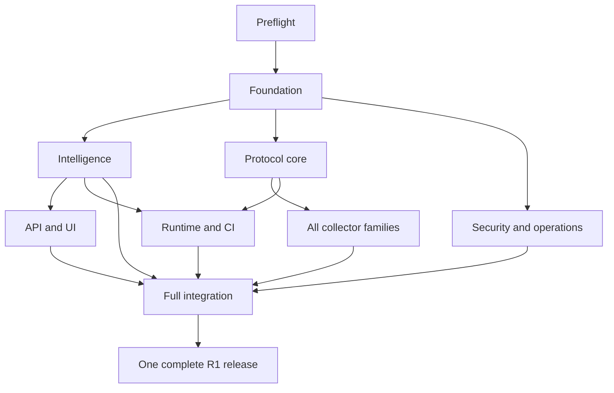

# Implementation and release plan

## Workstreams

The new task identifiers belong to this reconstructed baseline. They do not recover the original 122 tasks. Task details and acceptance associations are in [Traceability](backlog/traceability.json). All listed work is required.

| Phase | Deliverable | Entry dependency |
|---|---|---|
| P00 | Toolchain, dependency and support-profile preflight | Available baseline and owner decisions relevant to the task |
| P01 | Shared types, policies, queues, database and ingestion | P00 |
| P02 | Inference, comparison and governance | P01 |
| P03 | Gateway integrations | P01 and P11 |
| P04 | Linux eBPF | P01 and P11 |
| P05 | Managed browser | P01 and P11 |
| P06 | Android and iOS | P01 and P11 |
| P07 | AWS connectors | P01 and P11 |
| P08 | GCP connectors | P01 and P11 |
| P09 | Azure connectors | P01 and P11 |
| P10 | Message integrations | P01 and P11 |
| P11 | Protocol parsers and shared golden corpus | P01 |
| P12 | Catalog API, UI and review workflows | P02 |
| P13 | Security and operations | P01 |
| P14 | Full integration and release evidence | P02 through P13, plus P15 |
| P15 | Runtime, serverless, Kubernetes, Docker and CI | P01, P02 and P11 |

Start building the integration corpus during P01/P11. The final integration run still waits for all required lanes. A ready task has completed dependencies and available authorized resources. A task cannot become ready merely because its phase is listed first.

## Required evidence

Every task has an acceptance case with setup, action, expected result and required evidence. Every collector capability adds a real-platform case. Shared family gates add privacy and overload cases to every family; these cannot be satisfied only by testing one collector.

A test record must include case ID, source revision, test command, environment/version tuple, policy hash, start/end times, exit status, result, evidence locations and hashes. A reviewer must check that evidence tests the required behavior. Hashes alone do not prove truthful execution.

Allowed execution states are NOT_RUN, PASS, FAIL and BLOCKED. All cases start NOT_RUN. A release manifest must reject missing cases, unresolved failures, stale source associations and unverified platform claims. No waiver, mock pass or omitted family can satisfy R1.

## Release sequence

1. Finish shared contracts and executable schemas before dependent implementations.
2. Implement bounded tasks with relevant regression tests.
3. Review interfaces, trust boundaries and actual behavior independently.
4. Run each real collector profile and its limit tests.
5. Run the full privacy, security, recovery, performance and UI suites.
6. Assemble versioned packages and verify offline installation and upgrades.
7. Review the release evidence and obtain deployment authorization for its actual target.

The specification validator is not a product release gate. Product commands must be configured from real build and test entry points. Missing tools and unavailable accounts are blockers, not successful checks.
