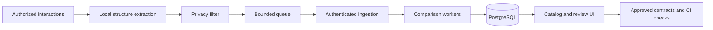

# APIContour R1 specification

APIContour observes authorized API interactions. It stores API structure, detects changes, and supports contract review. It must protect application availability and keep raw values out of exported and stored data.

Status: reconstructed design baseline 0.1. Product acceptance is NOT_RUN. This baseline implements the available requirements as specifications. It does not recover the missing original package. New technical choices and limits below are design targets, not measured results.

## Read the specification

1. [Product scope](01-product.md)
2. [Architecture and packaging](02-architecture.md)
3. [Privacy and security](03-privacy.md)
4. [Structural data and persistence](04-data.md)
5. [Collection and delivery](05-delivery.md)
6. [Platform APIs and review workflows](06-api-ui.md)
7. [Collector support contract](07-collectors.md)
8. [Performance and operations](08-operations.md)
9. [Implementation and release plan](09-plan.md)
10. [Decisions and prerequisites](10-decisions.md)
11. [Sources and scope reconciliation](11-sources.md)
12. [Validation and limits](12-validation.md)

[Traceability](backlog/traceability.json) maps requirements, capabilities, tasks and acceptance cases. [Batch schema](contracts/batch.schema.json) defines the initial ingestion format. [Platform API](contracts/platform.openapi.json) defines collector, catalog, review and administration endpoints. [Fixtures](fixtures/batches.json) provide positive and negative wire examples. Prose defines semantic constraints that JSON Schema cannot express.



All 16 workstreams and all named collector families are required for R1. A customer enables only its authorized collectors. A failed or unavailable integration blocks its release gate. It does not become optional.

Run the offline specification check from the repository root:

```sh
python3.13 docs/specification/validate.py
```

This check validates document links and traceability. It does not establish product correctness, schema-standard conformance, platform compatibility, or release readiness. Run `validate-standard.py` with the pinned validation requirements for full JSON Schema 2020-12 and OpenAPI checks. See [Validation](12-validation.md) for commands and executed evidence. Implementation tasks must add executable product tests for every acceptance case.
